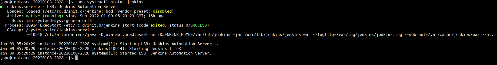

# Jenkins Install CentOS VM

>jenkins in VM Linux CentOS

## prerequisites

reference: [prerequisites](https://www.jenkins.io/doc/book/installing/linux/#prerequisites) 

>Minimum hardware requirements:
256 MB of RAM
1 GB of drive space (although 10 GB is a recommended minimum if running Jenkins as a Docker container)

>Recommended hardware configuration for a small team:
4 GB+ of RAM
50 GB+ of drive space

## installation

reference: [installation](https://www.jenkins.io/doc/book/installing/linux/#red-hat-centos)

Long Term Support release
A LTS (Long-Term Support) release is chosen every 12 weeks from the stream of regular releases as the stable release for that time period. It can be installed from the redhat-stable yum repository.

```
sudo wget -O /etc/yum.repos.d/jenkins.repo \
    https://pkg.jenkins.io/redhat-stable/jenkins.repo
sudo rpm --import https://pkg.jenkins.io/redhat-stable/jenkins.io.key
sudo yum upgrade
sudo yum install epel-release java-11-openjdk-devel
sudo yum install jenkins
sudo systemctl daemon-reload
```

if epel-release problem go this guide [epel-release installation](https://www.cyberciti.biz/faq/installing-rhel-epel-repo-on-centos-redhat-7-x/)

--------------

### Start Jenkins

Register the Jenkins service with the command:

```
sudo systemctl daemon-reload
```

You can start the Jenkins service with the command:

```
sudo systemctl start jenkins
```

You can check the status of the Jenkins service using the command:

```
sudo systemctl status jenkins
```

If everything has been set up correctly, you should see an output like this:




If you have a firewall installed, you must add Jenkins as an exception. You must change YOURPORT in the script below to the port you want to use. Port 8080 is the most common.

```
YOURPORT=8080
PERM="--permanent"
SERV="$PERM --service=jenkins"

firewall-cmd $PERM --new-service=jenkins
firewall-cmd $SERV --set-short="Jenkins ports"
firewall-cmd $SERV --set-description="Jenkins port exceptions"
firewall-cmd $SERV --add-port=$YOURPORT/tcp
firewall-cmd $PERM --add-service=jenkins
firewall-cmd --zone=public --add-service=http --permanent
firewall-cmd --reload
```