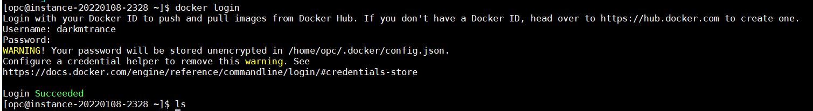

# 02-first-pipeline

reference: [Caos Binario](https://www.youtube.com/watch?v=oUTGnoQzciU&t=137s)

Jenkins Workshop

## prerequisites

- Verify git in VM (this workshop in CentOS VM)
- Install [docker](https://docs.docker.com/engine/install/centos/) in VM (this workshop in CentOS VM)
- Add jenkins user to the docker group 

```
sudo usermod -aG docker jenkins
```

- Docker login with your user workshop




